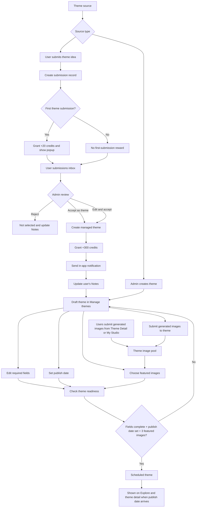

# 主题提交与管理流程设计

## 目标

网站的每日主题有两个来源：

- 用户通过 `Submit a theme` 提交主题想法。
- 管理员在后台直接创建主题。

无论主题来自用户还是管理员，最终都需要进入同一套管理员管理流程，补齐主题内容、SEO、生成器灵感、发布日期和精选图片后，才能用于前台展示。

这个文档定义：

- 用户如何提交主题。
- 管理员如何审核用户提交。
- 管理员如何创建和管理主题。
- 主题需要补齐哪些字段。
- 管理员如何向主题提交图片并选择精选图片。
- 积分奖励如何发放。

## 核心原则

主题提交和图片提交是两个不同动作。

用户提交主题时，只提交文本：

- 主题名称。
- 主题详情。
- 为什么提交这个主题，可选。

用户不需要提交说明图片。主题是否成立，应该由文本创意本身决定，而不是由用户提供的图片质量决定。

图片是在用户或管理员参与某个主题后提交到该主题下的作品。主题管理只关心某个主题下有哪些可用图片，以及哪些图片被设为精选。

## 总体流程



## 用户侧 Submit a Theme

### 页面定位

`Submit a theme` 是用户提交每日主题想法的入口，不是图片投稿入口。

页面应该明确告诉用户：

```text
Theme ideas are reviewed by text only.
Do not attach explanation images here.
If a theme is accepted, you can submit images to that theme from the theme page or My Studio.
```

### 表单字段

MVP 字段：

```text
Theme name
[ A Scene You Cannot Explain Having Seen Before ]

Theme details
[ Describe what people should create, what makes the theme open-ended, and what kind of visual thinking it invites. ]

Why are you submitting this theme? optional
[ Optional: explain why this idea could make a strong daily theme. ]

[Submit theme idea]
```

不需要：

- 图片上传。
- 从用户图片库选择说明图。
- SEO keywords。
- generator ideas。
- tags。

这些都由管理员在主题管理阶段补齐。

### 用户提交记录

`Submit a theme` 页面下方需要展示用户自己的提交记录：

```text
My theme ideas

Submitted idea              Submitted       Status          Notes
Dream Life in Reverse       Jun 14, 2026    Under review    Review pending.
Details: Imagine the life someone used to want, then show why it no longer fits who they are now.
Why: It turns a common dream-life idea into a reflective contrast.

Show Silence                Jun 10, 2026    Accepted        +300 credits granted. Scheduled for Jun 22, 2026.
Details: Create an image that makes silence visible without using text or obvious symbols.
Why: It is simple, open-ended, and invites many visual interpretations.
```

每条历史记录都需要展示用户原始填写的信息：

- Theme name。
- Theme details。
- Why are you submitting this theme，可选。
- Submitted date。
- Status。
- Notes。

用户侧状态保持简单：

- `Under review`
- `Accepted`
- `Not selected`

不向用户暴露过多内部运营状态。

## 奖励规则

奖励分为两部分。

### 首次提交奖励

用户第一次提交主题想法后获得少量积分。

推荐：

```text
First theme idea submission: +20 credits
```

规则：

- 只奖励一次。
- 不依赖审核结果。
- 用户必须登录。
- 建议邮箱验证后发放或允许使用。
- 首次提交成功后，用弹窗告知用户已发放积分。
- 这条积分信息只展示在用户第一条主题提交记录的 `Notes` 中。

这个奖励用于鼓励用户尝试参与，但不能按每次提交发放，否则会被刷。

### 主题通过奖励

用户提交的主题被管理员接受为正式可管理主题后，获得较高积分。

推荐：

```text
Accepted theme reward: +300 credits
```

触发条件：

- 管理员点击 `Accept as theme` 或 `Edit and accept`。
- 主题进入 `Manage themes` 列表。
- 系统自动发放 +300 credits。
- 系统自动发送站内信通知。

不触发：

- 被拒绝。
- 重复。
- 低质量。
- 不安全。
- 只提交但还在审核中。

如果管理员对用户提交的主题做了名称和详情修改，只要最终主题明显来自用户提交的核心想法，仍应发放通过奖励。

## 管理员后台结构

管理员后台应把主题相关逻辑收到同一个模块下。

推荐结构：

```text
Admin

Themes
  User submissions
  Manage themes
```

本文档只定义主题相关功能。

主题图片相关操作只在 `Manage themes` 中出现：

- 管理员向某个主题提交图片。
- 管理员从该主题下已有图片中选择精选图片。

精选图片是某个主题列表项上的操作，不是全局独立模块。

## 页面功能归属

### Submit a Theme 页面

用户侧页面。

负责：

- 提交主题文本想法。
- 展示用户自己的主题提交记录。
- 展示审核状态。
- 展示首次提交奖励和主题通过奖励状态。

不负责：

- 提交图片。
- 上传说明图。
- 编辑 SEO 字段。
- 选择精选图片。

### Explore 页面

前台浏览页面。

负责：

- 展示已排期或已发布主题。
- 主题卡片展示 3 张精选图、theme、brief、统计信息和 `View theme`。
- 引导用户进入主题详情页。

不负责：

- 直接从卡片创建图片。
- 展示完整 tags 或 SEO 信息。
- 管理主题。

### Theme Detail 页面

前台主题详情页。

负责：

- 展示主题完整内容。
- 展示主题说明、tags、generator ideas 和精选 gallery。
- 提供带当前主题上下文的创作面板。
- 允许用户把自己在站内生成的图片提交到当前主题。

不负责：

- 让用户提交新主题想法。
- 管理主题字段。
- 选择精选图片。

### My Studio 页面

用户个人创作工作台。

负责：

- 用户自由生成图片。
- 查看自己的生成图片。
- 将自己已生成的图片提交到某个主题。
- 查看图片提交状态。

不负责：

- 提交主题想法。
- 管理主题。
- 精选图片。

### Admin / Themes 页面

管理员主题管理页面。

负责：

- 审核用户提交的主题。
- 管理所有已接受和管理员创建的主题。
- 新增管理员主题。
- 编辑主题字段。
- 设置发布日期。
- 管理员向主题提交已生成图片。
- 为主题选择精选图片。

不负责：

- 管理非主题相关的图片流程。
- 用户个人创作。
- 前台主题浏览。

## Themes 模块

### User submissions Tab

这个 tab 只处理用户提交的原始主题想法。

列表字段：

- 用户提交的主题名称。
- 用户提交的主题详情。
- 用户。
- 提交时间。
- 审核状态。
- Notes。

操作：

- `Accept as theme`
- `Edit and accept`
- `Reject`

审核判断：

- 是否有明确创意思维动作。
- 是否开放，有解释空间。
- 是否适合 SFW 公共网站。
- 是否不是普通物体或普通风格。
- 是否区别于已有主题。
- 是否能被管理员编辑成更强的每日主题。

用户提交被接受后，进入 `Manage themes`，成为正式可管理主题。

接受主题时不需要管理员手动发积分。

系统应自动完成：

- 发放主题通过奖励。
- 发送站内信通知。
- 更新用户提交记录里的 `Notes`。

示例：

```text
Accepted. +300 credits granted. Notification sent.
```

### Manage Themes Tab

这个 tab 展示所有已通过或管理员创建的主题。

包括：

- 用户提交并被接受的主题。
- 管理员直接创建的主题。
- 已设置发布日期的主题。
- 还未设置发布日期的草稿主题。

列表字段：

```text
Theme
Brief
Source
Publish date
Status
Required fields
Featured images
Actions
```

列表排序：

- `publish_date` 为空的主题排在最上方。
- 已设置 `publish_date` 的主题按发布日期倒序排列。
- 这样管理员可以优先处理未排期主题，同时仍能快速看到最近排期的主题。

行级操作：

- `New theme`
- `Edit fields`
- `Set publish date`
- `Submit images`
- `Featured images`
- `Preview`

状态只需要：

- `Draft`
- `Scheduled`

不需要 `Published` 和 `Archived` 作为 MVP 状态。

原因：

- 是否已经发布可以通过 `Publish date` 判断。
- 下架、归档、隐藏属于后续运营能力，不是第一版主题管理的核心。

### Required Fields 展示

不要把所有主题字段平铺到列表上。

列表里只展示字段完成度摘要：

```text
Content ok
SEO ok
Ideas ok
Featured 3/3
```

或：

```text
Content ok
Missing SEO
Missing ideas
Featured 2/3
```

对应含义：

- `Content`：`theme`、`brief`、`themeNote` 是否完整。
- `SEO`：`seo.title`、`seo.metaDescription`、`seoKeywords` 是否完整。
- `Ideas`：`generatorIdeas` 是否足够。
- `Featured`：Explore 预览图是否已选满 3 张。

完整字段通过 `Edit fields` 弹窗或抽屉编辑。

## 主题字段

管理员需要为每个正式主题补齐 `docs/theme-keywords.md` 里的字段。

推荐数据结构：

```json
{
  "theme": "After Putting On Glasses",
  "brief": "Show how glasses reveal details, clarity, or a whole new way of seeing.",
  "themeNote": "Long-form explanation shown on the theme detail page.",
  "seo": {
    "title": "After Putting On Glasses - Glasses and Perspective AI Art Prompt",
    "metaDescription": "Create AI images about glasses, clearer vision, and new perspectives."
  },
  "tags": [
    "glasses",
    "clear vision",
    "new perspective"
  ],
  "seoKeywords": [
    "glasses AI art prompt",
    "perspective AI image prompt"
  ],
  "generatorIdeas": [
    "A person puts on glasses and finally recognizes a familiar face across a busy street.",
    "A city wearing giant transparent glasses, with only the view through the lenses becoming sharp."
  ],
  "imageSeoNotes": {
    "note": "Use image-level titles, alt text, and tags for featured images."
  }
}
```

### Edit Fields

`Manage themes` 列表中的 `Edit fields` 操作用于编辑：

- Theme。
- Brief。
- Theme note。
- SEO title。
- Meta description。
- Tags。
- SEO keywords。
- Generator ideas。
- Image SEO notes。

用户提交的原始标题和详情应保留在内部记录中，方便归因和奖励审计。

## 发布日期

每个主题可以设置一个发布日期。

字段：

```text
publish_date
status: Draft | Scheduled
```

规则：

- 没有发布日期时是 `Draft`。
- 设置发布日期后可以变为 `Scheduled`。
- 前台是否展示为今日主题、历史主题、即将发布主题，由当前日期和 `publish_date` 决定。

## 主题图片与精选图片

主题管理里只描述图片和主题之间的关系。

图片来源：

- 用户从 Theme Detail 或 My Studio 把自己已生成的图片提交到某个主题。
- 管理员在 `Manage themes` 中把站内已生成图片提交到某个主题。

这些图片组成该主题的 theme image pool。精选图片只能从这个主题自己的图片池中选择。

### Admin Submit Images

`Submit images` 是 `Manage themes` 列表中的行级操作。

管理员点击某个主题的 `Submit images` 后，打开弹窗或抽屉。

弹窗加载管理员可访问的已生成图片列表。

约束：

- 只能选择站内已生成图片。
- 不允许上传外部图片。
- 图片必须被提交到当前主题。
- 提交时必须填写图片标题。
- 图片介绍可选。

表单：

```text
Select generated images
[ image grid from generated images ]

Image title
[ Cat With Glasses ]

Image description optional
[ A white cat wearing glasses sits on a bright windowsill. ]

[Submit images to this theme]
```

如果一次选择多张图片，可以要求每张图片都有独立标题。MVP 也可以先限制一次提交一张图片，降低表单复杂度。

### Featured Images

`Featured images` 是主题管理里的行级操作。

管理员在 `Manage themes` 列表里点击某个主题的 `Featured images`，打开弹窗或抽屉。

弹窗加载该主题下已有图片：

- 缩略图。
- 作者。
- 图片标题。
- 图片介绍。
- 是否已精选。

管理员从中选择精选图。

MVP 要求：

- Explore 主题卡需要 3 张精选预览图。
- 只能从该主题下已有图片中选择。
- 已精选图片在主题列表中展示缩略图。

## 前台展示关系

### Explore Themes

Explore 的主题卡片展示最精简信息：

```text
[3 featured image thumbnails]

Theme
Brief

156 creations · 51 creators · 21 featured

[View theme]
```

不展示 tags。

不展示 `Create from this theme`。

用户应该先进入主题详情页理解主题，再在详情页生成图片。

### Theme Detail

主题详情页展示：

- Theme。
- Brief。
- Theme note。
- Tags。
- Generator ideas。
- Featured gallery。
- 带当前主题上下文的创作面板。

用户在详情页生成图片后，可以提交到该主题。

## 数据模型建议

### theme_submission

```text
theme_submission_id
user_id
raw_title
raw_details
raw_reason
status
notes
first_submission_credits_granted
accepted_credits_granted
notification_sent_at
duplicate_of_submission_id
accepted_theme_id
scheduled_publish_date
created_at
reviewed_at
```

### theme

```text
theme_id
source_type: user_submission | admin_created
source_submission_id
theme
brief
theme_note
seo_title
seo_meta_description
tags
seo_keywords
generator_ideas
image_seo_notes
publish_date
status: draft | scheduled
created_by_admin_id
updated_by_admin_id
created_at
updated_at
```

### theme_image

```text
theme_image_id
theme_id
image_id
submitted_by_user_id
submitted_by_admin_id
source: user_submitted | admin_submitted
image_title
image_description
prompt
created_at
```

### theme_featured_image

```text
theme_id
image_id
slot
surface: explore_preview | theme_gallery
created_by_admin_id
created_at
```

## 防滥用策略

主题提交防滥用：

- 必须登录。
- 限制每日提交次数。
- 首次提交奖励只发一次。
- 重复主题不给通过奖励。
- 不安全、垃圾、低质量主题不给通过奖励。
- 多次低质量提交的用户降低额度。

图片提交防滥用：

- 图片必须来自站内生成记录。
- 图片必须绑定主题。
- 管理员提交主题图片时不能上传外部图片。
- 管理员提交主题图片时必须填写图片标题。
- 精选图片只能从当前主题的图片池中选择。

## MVP 范围

包含：

- 用户提交主题文本表单。
- 用户自己的主题提交状态列表。
- 首次提交奖励。
- 主题通过奖励。
- Admin `Themes` 模块。
- `User submissions` tab。
- `Manage themes` tab。
- 管理员直接创建主题。
- 编辑主题完整字段。
- 设置发布日期。
- 管理员从已生成图片中提交图片到主题。
- 主题级精选图片弹窗。
- Explore 主题卡使用 3 张精选图。

延后：

- 公开 Community Ideas。
- 投票系统。
- 公开归因设置。
- 主题评论。
- 主题归档和下架。
- 多人共同贡献奖励拆分。

## 总结

主题系统应该围绕一个核心对象设计：正式可管理的 `theme`。

用户提交只是主题来源之一。管理员创建也是主题来源之一。两者最终都进入 `Manage themes`，由管理员补齐字段、设置发布日期、提交图片并选择精选图片。

第一版应保持流程清楚：

```text
User submissions -> Accept as theme -> Manage themes -> Complete fields + publish date + featured images -> Scheduled theme

Admin creates theme -> Manage themes -> Complete fields + publish date + featured images -> Scheduled theme
```
